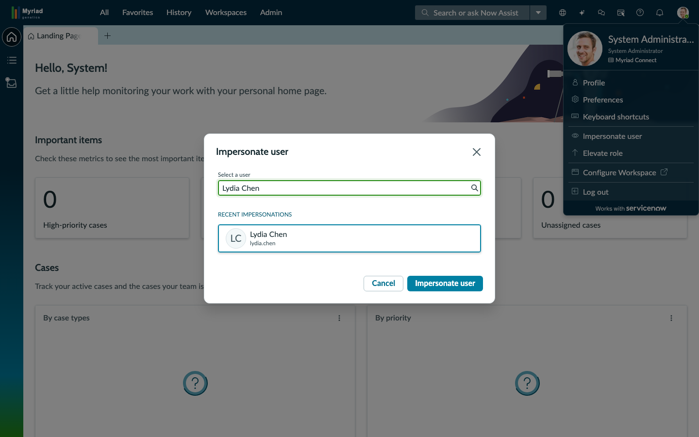
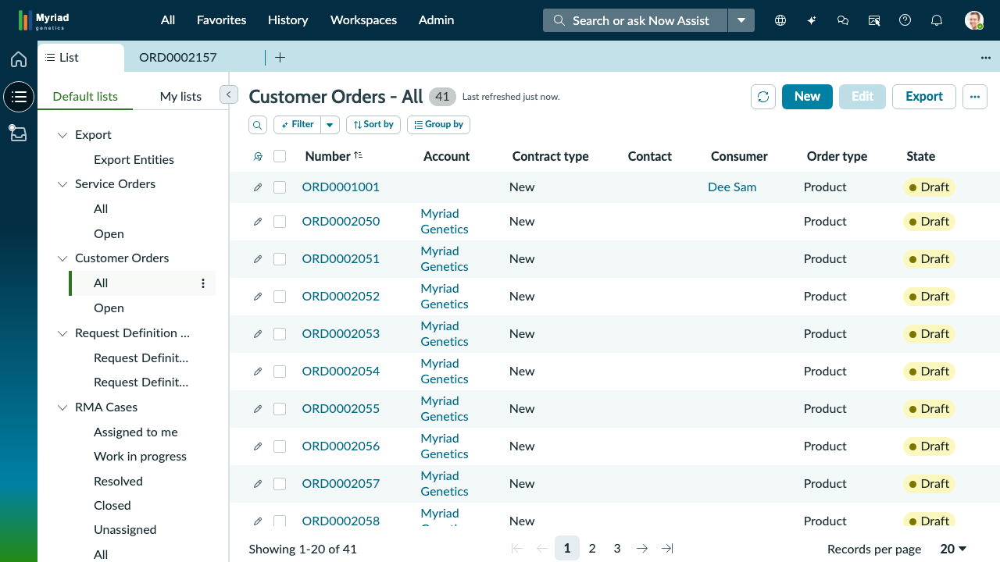
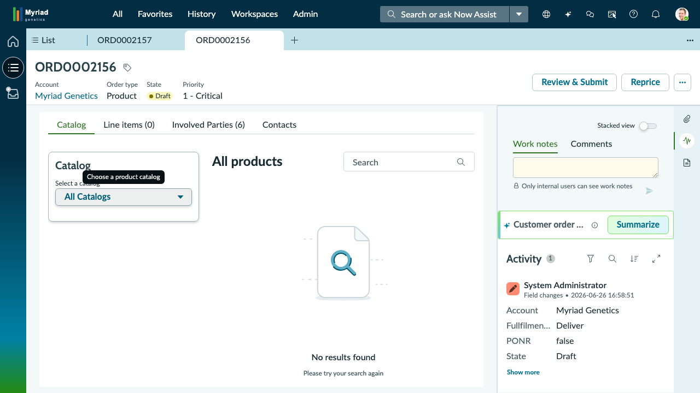

# Scenario 1: Submit a New MRD Process Order

### **Exercise 1: Placing the order**

**Persona:** Dr. Jennifer Park — Ordering Oncologist&#x20;

**Duration:** \~10 minutes&#x20;

**Objective:** Navigate the Myriad Provider Portal, and submit an order from Myriad's product offerings.

***

**Scene:** You are Dr. Jennifer Park, an ordering oncologist preparing care for your patient, Dorothy Martinez. The patient visit has just concluded, and you're ready to order MRD testing for Dorothy Martinez. Log in to the Myriad Provider Portal, locate the appropriate product, and complete the order submission accurately and efficiently.

***

## Step 1: Open the Myriad Provider Portal

Navigate to the provider portal by appending /**myriad-provider** to the end of your instance URL. You will see:

* A **top navigation bar** with options for **Dashboard**, **Submit Order**, **My Orders**, and **Specimen Tracking**
* A **welcome banner** with a **New Test Order** button
* Dashboard tiles displaying metrics such as **Total Orders**, **Specimens**, **Patients**, and **MRD Monitoring**
* A **Browse Tests** section featuring available Myriad products that can be ordered
* A **Recent Orders** section at the bottom of the page

> **Note:** This is your Myriad Provider Portal, the streamlined experience that you designed for healthcare providers to order tests, track specimens, and manage patients. Behind the scenes, very order submitted through the portal automatically creates a corresponding order in ServiceNow for your operations team to review and fulfill.&#x20;

***

## Step 2: Place the Order

1. Select **+Submit Order in** the top navigation.
2. Select your patient, **Dorothy Martinez** from the patient dropdown.&#x20;
3. Select **Jennifer Park** from the ordering provider dropdown.
4. Select a **30-day** cadence for the **MRD Monitoring** test.

<figure><figcaption></figcaption></figure>

> **Note:** The tests displayed in the Provider Portal represent your organization's product offerings. These offerings are managed through the ServiceNow Product Catalog, allowing you to control which tests providers can order. When a provider submits an order, a fulfillment workflow is automatically initiated in ServiceNow.

5. Click **Submit Order** and wait for the confirmation screen to load. In the confirmation message, select the **order hyperlink (ORDXXXXXXX).**&#x20;

<figure><figcaption></figcaption></figure>

#### Congratulations, you've just placed your first order! We're now going to take a look at it from the perspective of the Myriad operations team.&#x20;

***

### **Exercise 2: Orientation to the Order**

**Persona:** Sam Anderson

<mark style="color:red;">**Duration:**</mark> <mark style="color:red;"></mark><mark style="color:red;">Update</mark>&#x20;

**Objective:** Navigate the order recently placed and get up to speed about what it requires.

***

**Scene:** You are **Sam Anderson**, a member of the Myriad Order Operations team. Your role is to review incoming test orders, verify the information provided, and ensure each order is ready to move through the fulfillment process. An order has just been submitted through the Myriad Provider Portal by Dr. Jennifer Park for patient Dorothy Martinez. Your task is to locate the order in ServiceNow, review its details, and understand the information your team uses to process and fulfill provider requests.

***

Upon clicking the ORD hyperlink, the order will **open in the ServiceNow workspace**. You will see:

<figure><figcaption></figcaption></figure>

* An **order header** displaying key details such as the order number, patient, order type, state, priority, and current status.
* A set of **related tabs** that organize the work required to fulfill the order:
  * **Line Items** represent the products or services that were ordered.
  * **Order Tasks** contain the individual fulfillment activities required to complete the order. These tasks are automatically generated based on the fulfillment workflow configured for the selected product offering.
  * **Specimens** track the samples required for the test, including their collection and processing status. These records are also created automatically based on the selected product offering.
  * **MRD Monitoring Series** groups the patient's scheduled monitoring events into a single series, allowing your team to track recurring MRD testing over time. The cadence and monitoring schedule are generated from the product configuration.
* An **Order Overview** panel on the left with fulfillment details, important dates, and links to the order timeline and orchestration, helping you understand where the order is in its lifecycle.
* A **collaboration panel** on the right where your team can communicate and document progress:
  * **Work Notes** are visible only to internal users and are used to document progress, hand off work, troubleshoot issues, and communicate with other fulfillment team members.
  * **Comments** can be shared with external users, such as healthcare providers, when updates or additional information need to be communicated.
  * The **Activity** stream provides a chronological history of changes, updates, and communications related to the order.
* A **Customer Order Summary** panel that uses AI to generate a concise overview of the order. The summary highlights key information—such as the patient, ordering provider, product offering, monitoring cadence, fulfillment status, and upcoming specimen collection dates—so you can quickly understand the order before diving into the individual records.

1. Click the **Customer order summary button** to see a concise summary of this order.

<figure><figcaption></figcaption></figure>

#### Congratulations, you have reviewed the submitted order!

***

## Step 5: Impersonate Dr. Lydia Chen

**Click "Impersonate user"** in the avatar dropdown.

A dialog box appears with a search field:

1. **Type** `lydia` in the search field
2. Look for **"Lydia Chen"** in the results
3. **Click "Lydia Chen"** to select her
4. The **"Impersonate user"** button at the bottom becomes active (turns blue/enabled)

5. **Click "Impersonate user"** to confirm

The page reloads. You are now operating as Dr. Lydia Chen. The avatar in the top-right now reflects her profile.

> **Note:** All records, lists, and permissions now reflect Lydia's role. To return to your own login at any time: **Avatar → End impersonation**.

***

## Step 6: Navigate to the Customer Orders List

Look at the **dark left sidebar** and **click the hamburger icon** (☰ — the three horizontal lines, second icon from top).

A flyout panel slides out showing **Default lists** with record categories. Look for:

**Default lists → Customer Orders → All**

**Click "All"** under Customer Orders.

The main area now shows a table of Customer Orders with columns: **Number | Account | Contract type | Contact | Consumer | Order type | State**

> **Note:** This is the orders queue — 41 orders total. Each row is one order. You can click any column header to sort. The search/filter bar above the list lets you narrow results.

***

## Step 7: Locate ORD0002157

In the Customer Orders list, look for the row with Number **ORD0002157**.

> **Tip:** If you don't see it immediately, use the search bar above the list — type `ORD0002157` and press **Enter**.

> **Where did this order come from?** ORD0002157 was not entered manually into ServiceNow. Dr. Lydia Chen placed it in **Epic** — Huntsman Cancer Institute's electronic health record system. Epic transmitted the order automatically to Myriad's ServiceNow OMS as a FHIR R4 ServiceRequest message. ServiceNow received it, created this Customer Order record, and queued it for intake — all within seconds, with no one at Myriad lifting a finger. This is the Epic → ServiceNow integration in action. See [Epic Integration Background](epic-integration.md) for the full picture.

**Click the blue "ORD0002157" link** in the Number column.

The record opens in a new tab. The tab bar now shows: **List | ORD0002157**

***

## Step 8: Explore the Split-Pane Record View

The order opens in a **split-pane layout**:

* **Left pane (Form):** Fields and details — Number, Short description, State, Priority, Account, and tabs (Catalog, Line items, Involved Parties, Contacts)
* **Right pane:** Work notes | Comments tabs at top, then the **Activity stream** below showing all changes and notes on this record

> **Note:** The screenshot shows a reference order (ORD0002156) in the same layout. Your ORD0002157 view will be identical in structure.

***

## Step 9: Review the Key Order Fields

In the left form pane, locate these fields:

| Field                 | Value                                       | What It Means                                       |
| --------------------- | ------------------------------------------- | --------------------------------------------------- |
| **Number**            | ORD0002157                                  | Unique order ID — use this to find the record later |
| **Short description** | MyRisk 25-Gene Panel — BRCA1 family history | The test ordered — 25-gene hereditary cancer panel  |
| **Account**           | Myriad Genetics                             | The laboratory processing this order                |
| **Order type**        | Product                                     | Classification in the order system                  |
| **State**             | Draft                                       | Not yet active — pending review and intake          |
| **Priority**          | 2 - High                                    | How urgently this order needs attention             |

***

## Step 10: View the Activity Stream

On the **right pane**, click the **Activity** section header to expand it (if not already open).

The Activity stream shows a timestamp log of every change and note added to this order. Even at this early stage, you can see the creation event — who created it, when, and what fields were set.

> **Note:** As the order progresses through intake → eligibility → processing → results, each step is logged here. This is how Myriad operations teams stay informed without sending emails.

***

## Step 11: End Impersonation

You have reviewed ORD0002157 from Dr. Lydia Chen's perspective.

**Click the avatar icon → "End impersonation"** to return to the admin session.

***

## ✅ Exercise 1 Checkpoint

You have successfully:

* Navigated the CSM/FSM Configurable Workspace
* Used the impersonation feature to take a provider's perspective
* Located a new order (ORD0002157) in the Customer Orders list
* Examined the split-pane record view with form fields and Activity stream

**What happens next:** ORD0002157 is now in the intake queue. Lisa Morgan's oversight role is to monitor all open orders and escalate the most critical ones — that's Exercise 2.
