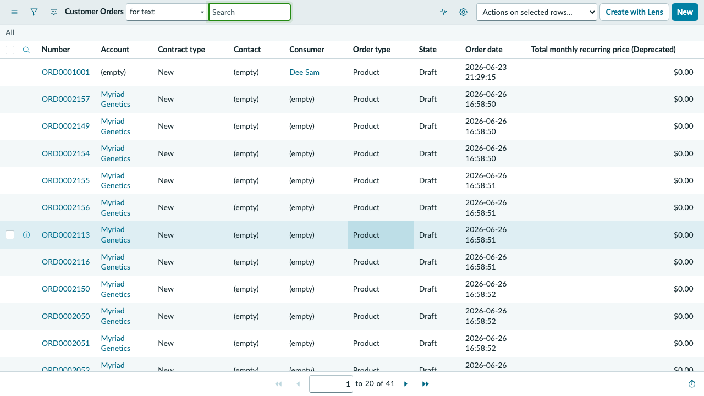
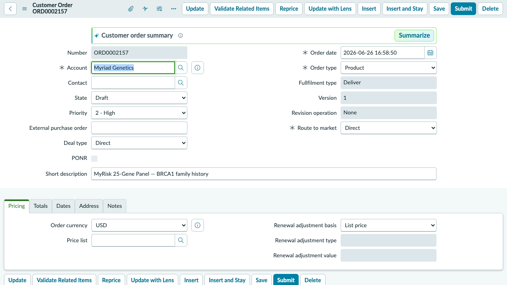
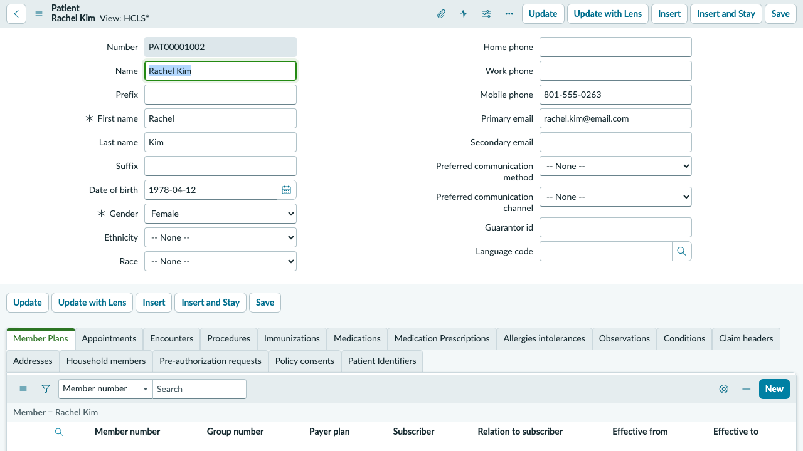

## Exercise 1: Submit a New Genomic Test Order

**Persona: Dr. Lydia Chen — Ordering Oncologist, Huntsman Cancer Institute**
**Duration: ~10 minutes**

> **Objective:** Experience the order submission workflow as a provider. You will navigate to the Order Management module, review a newly submitted order for patient Rachel Kim, and understand what happens immediately after an order enters the Myriad system.

---

### Scene

Rachel Kim is a 34-year-old patient of Dr. Lydia Chen with a documented family history of BRCA1-positive breast cancer. During today's appointment, Dr. Chen ordered the **MyRisk 25-Gene Hereditary Cancer Panel** to assess Rachel's inherited cancer risk. The order has just been submitted through the provider portal and is now visible in the intake queue.

---

### Step 1 — Impersonate Dr. Lydia Chen

1. From the home page, select your **user avatar** in the top-right corner.
2. Select **Impersonate another user**.
3. In the search field, type `lydia` and select **Dr. Lydia Chen** from the list.
4. Select **Impersonate user**.

> You are now operating as Dr. Lydia Chen. The experience will reflect her role-based access — provider portal navigation, patient records she has ordered for, and her order history.

---

### Step 2 — Navigate to Order Management

1. In the top navigation bar, select **All** (the search icon or hamburger menu).
2. In the filter navigator, type `Order Management`.
3. Select **Order Management > Orders** from the results.

> The Orders list displays all orders visible to Dr. Chen — filtered by her provider relationship to the patients.

---

### Step 3 — Locate Rachel Kim's New Order

1. In the Orders list, locate **ORD0002157** — *MyRisk 25-Gene Hereditary Cancer Panel — BRCA1 family history*.
2. Note the following fields on the list view:
   - **Order Status:** New
   - **Patient:** Rachel Kim
   - **Opened:** Today's date
   - **Eligibility Status:** Pending
3. Select **ORD0002157** to open the order record.

---

### Step 4 — Review the Order Record

Examine the key fields on the order form:

| Field | Value | Significance |
|-------|-------|-------------|
| **Patient** | Rachel Kim | Links to the Patient 360 record — MRN, demographics, prior orders |
| **Ordering Provider** | Dr. Lydia Chen | Required for signature validation and results delivery |
| **Facility** | Huntsman Cancer Institute | Determines collection kit routing and courier schedule |
| **ICD-10 Code** | Z15.01 | Genetic susceptibility to malignant neoplasm of breast — required for insurance auth |
| **Collection Method** | Blood Draw | Determines kit type dispatched to facility |
| **Eligibility Status** | Pending | Insurance verification not yet initiated — Sarah Rice's queue |
| **Insurance Member ID** | UHC-312-RCK | UnitedHealthcare Choice Plus — will drive prior auth workflow |

---

### Step 5 — View Rachel Kim's Patient Record

1. On the order form, select the **Patient** field link — **Rachel Kim**.
2. The Patient 360 record opens. Review:
   - **Date of Birth** and **MRN** (RCK-2024-0312)
   - **Active Conditions** tab — *Genetic susceptibility to malignant neoplasm of breast (Z15.01), Family history of malignant neoplasm of breast (Z80.3)*
   - **Appointments** tab — upcoming blood draw scheduled for July 14, 2026

3. Navigate back to the order using your browser back button.

---

### Step 6 — End Impersonation

1. Select your **user avatar** in the top-right corner.
2. Select **End impersonation** to return to the admin session.

---

### ✅ Exercise 1 Checkpoint

You have experienced the order submission entry point from the provider's perspective. Key observations:

- Orders arrive in **New** status with insurance eligibility pending.
- The Patient 360 record links clinical context (conditions, appointments) directly to the order.
- The ordering provider, facility, ICD-10, and collection method are all captured at submission — these fields drive downstream routing, kit dispatch, and insurance authorization workflows.

**What happens next:** ORD0002157 is now in Lisa Morgan's oversight queue. An intake task is automatically assigned to Sarah Rice's team for eligibility verification. You'll see both in Exercise 2 and 3.

---
