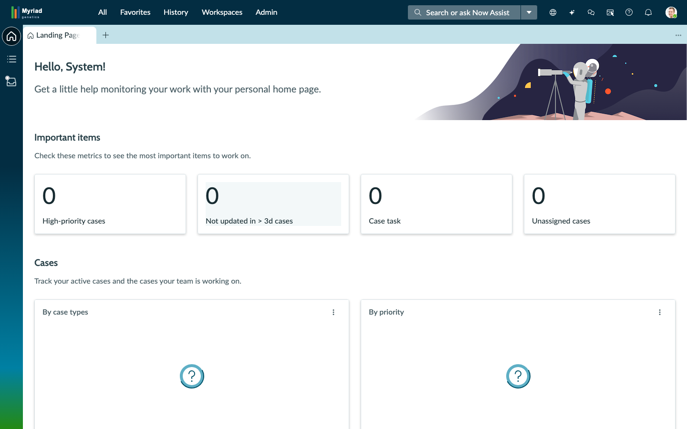
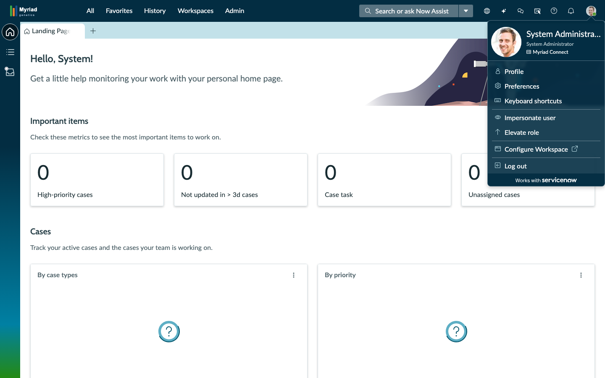
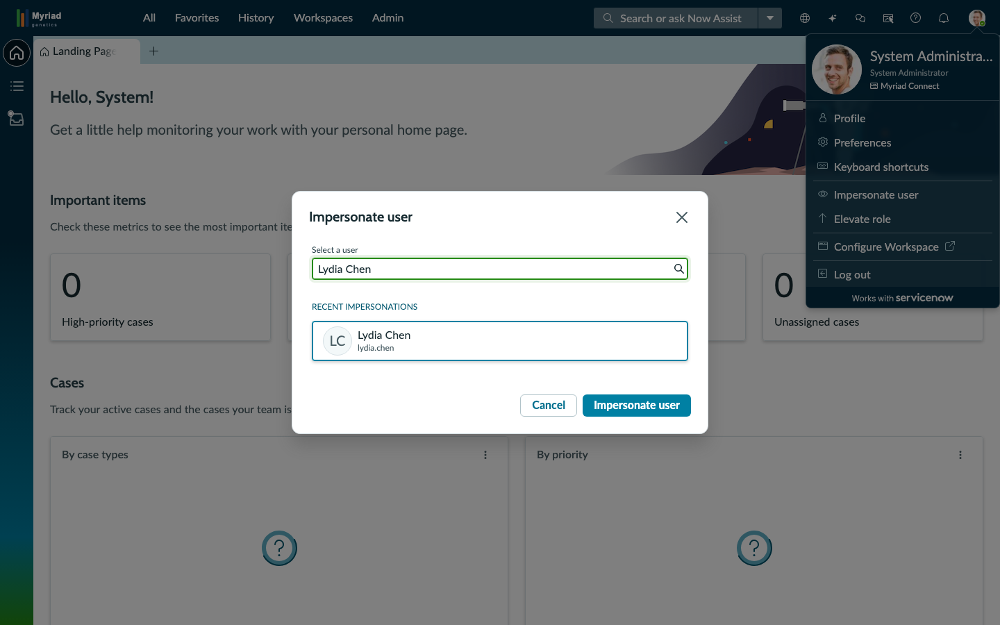
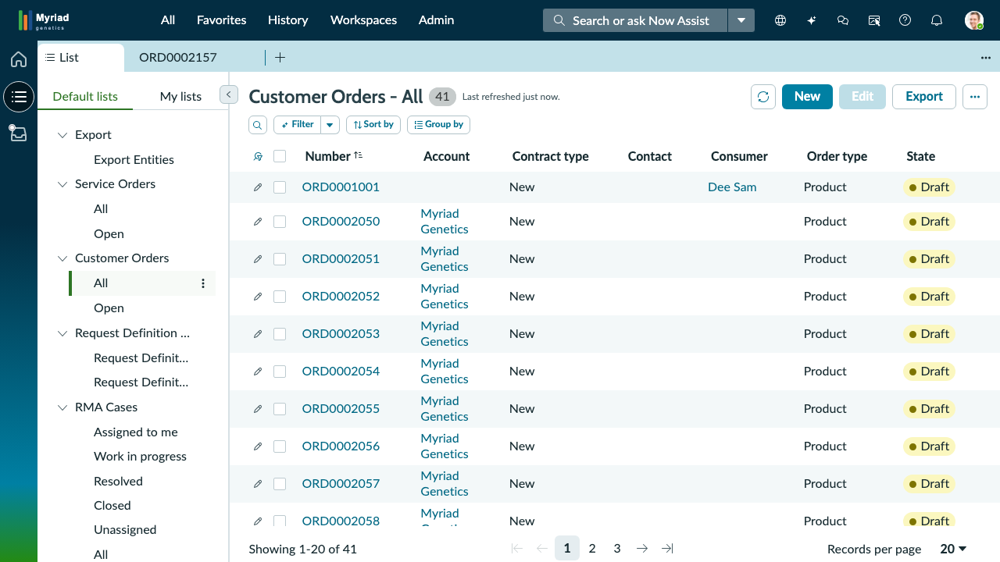
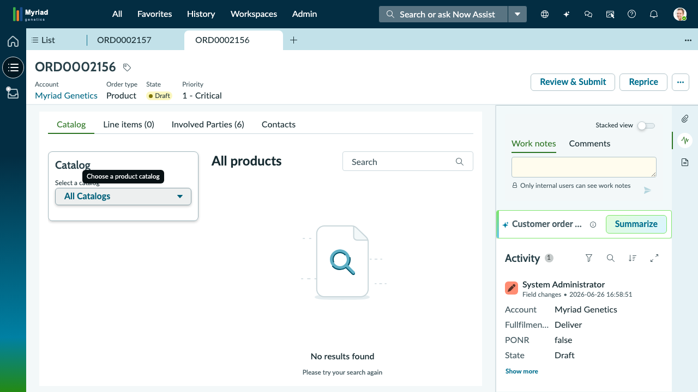

## Exercise 1: Submit a New Genomic Test Order

**Persona:** Dr. Lydia Chen — Ordering Oncologist
**Duration:** ~10 minutes
**Objective:** Navigate the CSM/FSM Configurable Workspace, impersonate Dr. Lydia Chen, locate a genomic test order in the Customer Orders list, open the record, and understand the key order fields.

---

**Scene:** Dr. Lydia Chen recently placed a MyRisk 25-Gene Hereditary Cancer Panel order for a patient with a BRCA1 family history. The order has just arrived in the Myriad Genetics OMS system. Your job is to view it from her perspective and confirm the order details.

---

### Step 1: Open the Configurable Workspace

Navigate to the Configurable Workspace using the URL provided by your instructor. You will see:
- A **dark-colored left sidebar** running top-to-bottom with a few small icons
- A large main area showing a greeting and metrics dashboard
- A **top navigation bar** across the very top of the screen

> **Note:** This is the CSM/FSM Configurable Workspace — designed for agents and reps who work records day-to-day. The modern panel-based layout is different from the classic ServiceNow back-end interface.

---

### Step 2: Orient Yourself — The Left Sidebar

The **dark left sidebar** has three icons from top to bottom:

| Icon | Looks Like | What It Does |
|---|---|---|
| **Home** | A small house | Returns you to the Workspace landing page |
| **Lists** | Three horizontal lines (☰) | Opens the full list of record categories |
| **Cases** | A briefcase/folder | Quick shortcut to the Cases list |

> **Tip:** Hovering over any sidebar icon shows a tooltip with its name.

---

### Step 3: Orient Yourself — The Top Navigation Bar

The top navigation bar contains from left to right:
1. **All** — Shows all available menus and modules
2. **Favorites** — Bookmark frequently-used records or lists
3. **History** — Recently visited records and pages
4. **Workspaces** — Switch to a different workspace
5. **Admin** — Administrative options
6. **"Search or ask Now Assist"** — Global search bar
7. **Avatar icon** — Circular photo at the **far top-right corner** — your user menu

---

### Step 4: Open the Avatar Menu

Locate the **avatar** — the circular photo icon at the **top-right corner** of the screen.

**Click the avatar.**

A dropdown menu appears with several options including:
- Profile
- **Impersonate user**
- Preferences
- Log out

> **Note:** "Impersonate user" lets you view the system as another person — no password needed. This is how we'll switch perspective to Dr. Lydia Chen.

---

### Step 5: Impersonate Dr. Lydia Chen

**Click "Impersonate user"** in the avatar dropdown.

A dialog box appears with a search field:

1. **Type** `lydia` in the search field
2. Look for **"Lydia Chen"** in the results
3. **Click "Lydia Chen"** to select her
4. The **"Impersonate user"** button at the bottom becomes active (turns blue/enabled)

5. **Click "Impersonate user"** to confirm

The page reloads. You are now operating as Dr. Lydia Chen. The avatar in the top-right now reflects her profile.

> **Note:** All records, lists, and permissions now reflect Lydia's role. To return to your own login at any time: **Avatar → End impersonation**.

---

### Step 6: Navigate to the Customer Orders List

Look at the **dark left sidebar** and **click the hamburger icon** (☰ — the three horizontal lines, second icon from top).

A flyout panel slides out showing **Default lists** with record categories. Look for:

**Default lists → Customer Orders → All**

**Click "All"** under Customer Orders.

The main area now shows a table of Customer Orders with columns:
**Number | Account | Contract type | Contact | Consumer | Order type | State**

> **Note:** This is the orders queue — 41 orders total. Each row is one order. You can click any column header to sort. The search/filter bar above the list lets you narrow results.

---

### Step 7: Locate ORD0002157

In the Customer Orders list, look for the row with Number **ORD0002157**.

> **Tip:** If you don't see it immediately, use the search bar above the list — type `ORD0002157` and press **Enter**.

> **Where did this order come from?** ORD0002157 was not entered manually into ServiceNow. Dr. Lydia Chen placed it in **Epic** — Huntsman Cancer Institute's electronic health record system. Epic transmitted the order automatically to Myriad's ServiceNow OMS as a FHIR R4 ServiceRequest message. ServiceNow received it, created this Customer Order record, and queued it for intake — all within seconds, with no one at Myriad lifting a finger. This is the Epic → ServiceNow integration in action. See [Epic Integration Background](epic-integration.md) for the full picture.

**Click the blue "ORD0002157" link** in the Number column.

The record opens in a new tab. The tab bar now shows: **List | ORD0002157**

---

### Step 8: Explore the Split-Pane Record View

The order opens in a **split-pane layout**:

- **Left pane (Form):** Fields and details — Number, Short description, State, Priority, Account, and tabs (Catalog, Line items, Involved Parties, Contacts)
- **Right pane:** Work notes | Comments tabs at top, then the **Activity stream** below showing all changes and notes on this record

> **Note:** The screenshot shows a reference order (ORD0002156) in the same layout. Your ORD0002157 view will be identical in structure.

---

### Step 9: Review the Key Order Fields

In the left form pane, locate these fields:

| Field | Value | What It Means |
|---|---|---|
| **Number** | ORD0002157 | Unique order ID — use this to find the record later |
| **Short description** | MyRisk 25-Gene Panel — BRCA1 family history | The test ordered — 25-gene hereditary cancer panel |
| **Account** | Myriad Genetics | The laboratory processing this order |
| **Order type** | Product | Classification in the order system |
| **State** | Draft | Not yet active — pending review and intake |
| **Priority** | 2 - High | How urgently this order needs attention |

---

### Step 10: View the Activity Stream

On the **right pane**, click the **Activity** section header to expand it (if not already open).

The Activity stream shows a timestamp log of every change and note added to this order. Even at this early stage, you can see the creation event — who created it, when, and what fields were set.

> **Note:** As the order progresses through intake → eligibility → processing → results, each step is logged here. This is how Myriad operations teams stay informed without sending emails.

---

### Step 11: End Impersonation

You have reviewed ORD0002157 from Dr. Lydia Chen's perspective.

**Click the avatar icon → "End impersonation"** to return to the admin session.

---

### ✅ Exercise 1 Checkpoint

You have successfully:
- Navigated the CSM/FSM Configurable Workspace
- Used the impersonation feature to take a provider's perspective
- Located a new order (ORD0002157) in the Customer Orders list
- Examined the split-pane record view with form fields and Activity stream

**What happens next:** ORD0002157 is now in the intake queue. Lisa Morgan's oversight role is to monitor all open orders and escalate the most critical ones — that's Exercise 2.

---
