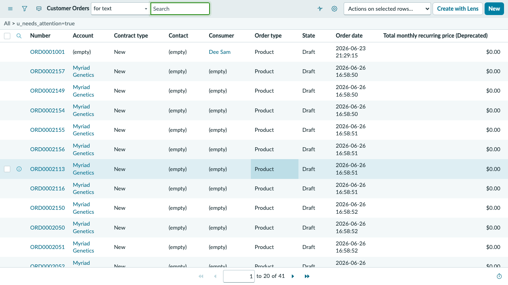
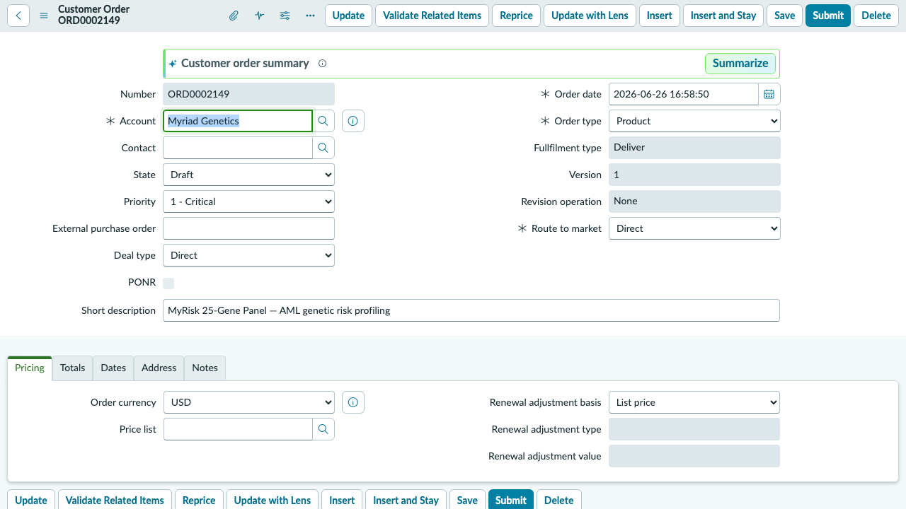
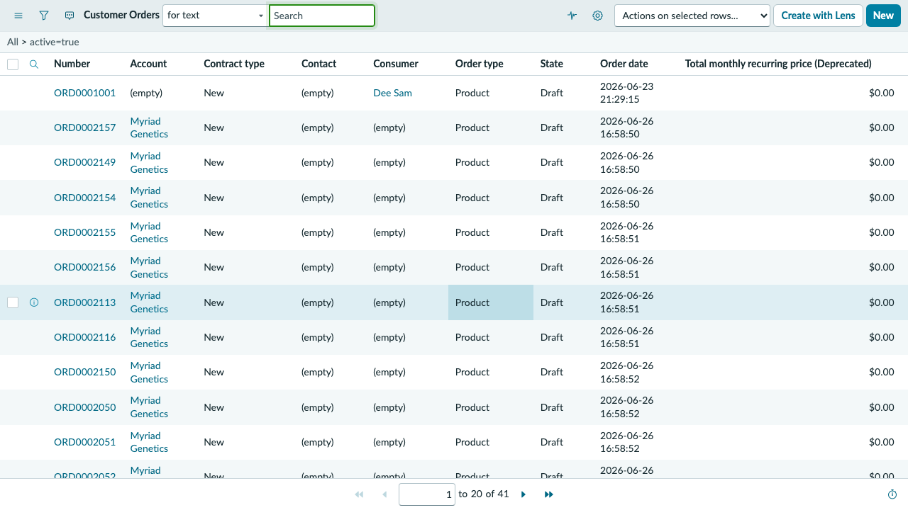

## Exercise 2: Order Pipeline Oversight

**Persona: Lisa Morgan — Order Oversight Manager**
**Duration: ~15 minutes**

> **Objective:** Take Lisa Morgan's seat at the Order Management workspace. You will review the full order pipeline, identify stalled orders flagged for attention, and deep-dive into Dorothy Martinez's complex order history — three active orders at different stages of processing.

---

### Scene

Lisa Morgan runs daily pipeline reviews each morning at 8:00 AM. Her job is to ensure no order ages out, every attention flag gets triaged, and the lab's turnaround commitments are met. Today's queue has several orders flagged — and Dorothy Martinez's case requires particular attention: two orders are active, one is stalled, and her MRD monitoring series starts in July.

---

### Step 1 — Impersonate Lisa Morgan

1. Select your **user avatar** (top-right) → **Impersonate another user**.
2. Type `lisa` → select **Lisa Morgan** → **Impersonate user**.

---

### Step 2 — Navigate to Order Management

1. In the filter navigator, type `Order Management`.
2. Select **Order Management > Orders**.

---

### Step 3 — Filter for Orders Needing Attention

1. In the Orders list, look for the **Needs Attention** column (or use the search bar to filter).
2. Select the column header **Needs Attention** to sort — or apply a filter: `Needs Attention = true`.
3. You should see the following orders flagged:

| Order | Patient | Status | Days Open | Issue |
|-------|---------|--------|-----------|-------|
| ORD0002149 | Dorothy Martinez | Awaiting Information | 33 days | Stalled since May 22 |
| ORD0002156 | Patricia Williams | New | 40 days | 6 open exceptions — stalled EndoPredict |
| ORD0002150 | Linda Patel | Awaiting Information | 29 days | Insurance eligibility pending |
| ORD0002116 | Noah Gillen | Lab Processing | 21 days | Overdue tasks |

> **Observation:** ORD0002156 (Patricia Williams) has the highest exception count. This is the order your team will work through in Exercise 3 and 4.

---

### Step 4 — Review Dorothy Martinez's Order History

Dorothy Martinez is your most complex active patient. She has three simultaneous orders at different stages.

1. In the Orders list, clear the **Needs Attention** filter.
2. Add a filter: **Patient = Dorothy Martinez** (or search `DMZ-2024-0847` in the patient field).
3. You will see three orders:

| Order | Test | Status | Opened |
|-------|------|--------|--------|
| ORD0002149 | MyRisk 25-Gene Hereditary Panel | Awaiting Information | May 22, 2026 |
| ORD0002154 | MRD Baseline — AML | Lab Processing | June 2, 2026 |
| ORD0002155 | Precise Tumor 500 | Sample Received | June 10, 2026 |

---

### Step 5 — Open ORD0002149 (Stalled MyRisk Order)

1. Select **ORD0002149** to open the record.
2. Review the order details:
   - **Status:** Awaiting Information
   - **Days in current status:** 33 days — *this order has not moved in over a month*
   - **Collection Method:** Blood Draw (submitted via fax — not the portal)
   - **Eligibility Status:** Pending

3. Scroll down to the **Order Tasks** related list.
4. Note the tasks in **Awaiting Information** or **Open** state.

> **Why is this stalled?** The order came in via fax — missing the electronic submission metadata that drives automatic insurance verification. Someone needs to manually initiate eligibility for XYZ-847-DMZ (Blue Cross Blue Shield Federal Employee Plan).

---

### Step 6 — Open ORD0002154 (MRD Baseline — Active)

1. Navigate back to the Orders list (use the breadcrumb or back button).
2. Select **ORD0002154** — *MRD Baseline — AML*.
3. Review:
   - **Status:** Lab Processing — sample is in the lab, sequencing in progress
   - **Timepoint:** Baseline — this is the anchor for Dorothy's 12-month MRD monitoring series
   - **Upcoming:** Results expected ~July 1, 2026 — Dr. Chen has a results review appointment booked July 10

4. Scroll to **Order Tasks** — note tasks are progressing (no attention flags).

---

### Step 7 — Open ORD0002155 (Precise Tumor 500)

1. Navigate back → select **ORD0002155** — *Precise Tumor 500*.
2. Review:
   - **Status:** Sample Received — tissue biopsy received from Huntsman, awaiting processing
   - **Collection Method:** Tissue Biopsy — FFPE tumor block from April 5 procedure
   - **Expected Turnaround:** 21 days

---

### Step 8 — Review the Full Pipeline (Optional — if time permits)

1. Navigate back to Orders list.
2. Remove all filters to see the full order queue.
3. Sort by **Opened** (oldest first) to understand queue aging.

> **Lisa's insight:** The pipeline shows clear concentrations at Awaiting Information and Lab Processing — the two stages where orders most commonly stall. The goal is to reduce time-in-status at both stages using automated exception routing and task escalation.

---

### Step 9 — End Impersonation

1. Select your **user avatar** → **End impersonation**.

---

### ✅ Exercise 2 Checkpoint

From Lisa Morgan's view you observed:

- **Attention flags** surface the highest-risk orders immediately — no manual queue scanning required.
- Dorothy Martinez has **three simultaneous active orders** at different lifecycle stages — a common scenario for oncology patients undergoing multi-test workups.
- Order aging is visible from the list view, allowing the oversight manager to prioritize triage without opening individual records.

**What happens next:** ORD0002156 (Patricia Williams' stalled EndoPredict) has the most open exceptions. Sarah Rice's task queue is where those exceptions get resolved — that's Exercise 3.

---
