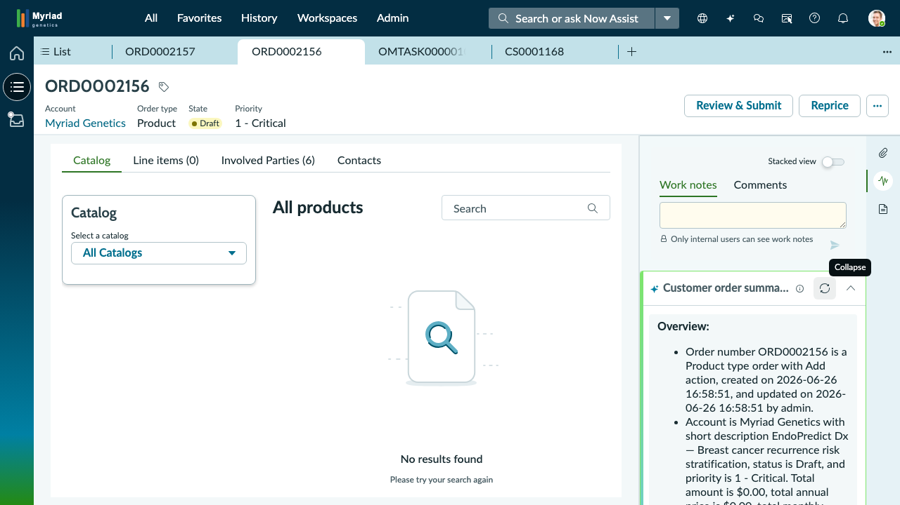

## Exercise 2: Order Pipeline Oversight

**Persona:** Lisa Morgan — Order Oversight Manager
**Duration:** ~15 minutes
**Objective:** Impersonate Lisa Morgan, navigate to the Customer Orders queue, identify and open the highest-priority order (ORD0002156), review its fields, and use Now Assist to generate an AI-powered summary.

---

**Scene:** Lisa Morgan starts every shift the same way — she opens the orders queue and scans for priority flags. Anything marked **Priority 1-Critical** gets her attention first. Today, that order is **ORD0002156: EndoPredict Dx — Breast cancer recurrence risk stratification**. Let's walk through her workflow step by step.

---

### Step 1: Impersonate Lisa Morgan

Before you can see what Lisa sees, you need to tell ServiceNow to treat you *as* Lisa. This is called **impersonation** — it lets you experience the platform exactly as another user would, without logging out of your own account.

1. Look at the **very top-right corner** of the screen. You will see a small **avatar icon** (it may show your initials or a generic person silhouette).
2. **Click** that avatar icon. A dropdown menu will appear.
3. In the dropdown menu, click **Impersonate user**.
4. A dialog box will appear with a search field. Type **Lisa Morgan** into the search field.
5. When her name appears in the results below the search field, **click** on **Lisa Morgan** to select her.
6. Click the **Impersonate user** button to confirm.

The page will briefly reload. You are now working as Lisa Morgan. Everything you see and do from this point forward reflects her role and permissions.

> **Note:** Impersonation does not affect the real Lisa Morgan's account. It is a safe training feature. You will end impersonation at the close of this exercise.

---

### Step 2: Locate the Left Sidebar and Open "All"

Look at the **left edge** of your screen. You will see a **dark-colored vertical sidebar**. This sidebar is your main navigation tool in the Configurable Workspace — think of it like a table of contents for the entire system.

At the **top** of the sidebar, you will see a row of navigation tabs:

**All** | **Favorites** | **History** | **Workspaces** | **Admin**

1. **Click** the tab labeled **All**.

This opens a full list of all available menus and modules — everything the platform can do, organized into categories.

> **Note:** If you ever feel lost in ServiceNow, clicking **All** in the left sidebar brings you back to this master menu. It is your home base.

---

### Step 3: Navigate to Customer Orders > All

Now you need to find the Customer Orders list. You will use the **filter bar** at the top of the All menu to search for it quickly instead of scrolling through dozens of categories.

1. At the top of the All menu, you will see a **filter/search field**. Click into it and type **Customer Orders**.
2. As you type, the menu will narrow down to show matching results. You will see a category called **Customer Orders** appear.
3. Under the **Customer Orders** category, you will see a sub-item labeled **All**.
4. **Click** on **All**.

The main area of your screen (the large panel to the right of the sidebar) will now display the **Customer Orders list** — a table showing every order in the system.

> **Note:** "All" means *all orders with no filters applied*. This gives Lisa a complete, unfiltered view of the queue — exactly what she needs for her morning scan.

---

### Step 4: Orient Yourself to the Orders List

Take a moment to read the list that just loaded. This is the **orders queue** — the table Lisa reviews at the start of every shift.

Look at the **column headers** running across the top of the table:

| **Number** | **Account** | **Contract type** | **Contact** | **Consumer** | **Order type** | **State** |
|---|---|---|---|---|---|---|

Each **row** below the headers represents a single customer order. The list contains **41 orders total**. Here is what the key columns tell you:

- **Number** — The unique order ID (e.g., ORD0002156).
- **Account** — The customer company (all orders here belong to **Myriad Genetics**).
- **Order type** — The category of order (these are all **Product** type).
- **State** — Where the order is in its lifecycle (e.g., **Draft**).

> **Note:** You may need to scroll down to see all 41 orders. For now, focus on what is visible at the top of the list.

---

### Step 5: Identify the Highest-Priority Order

Lisa is looking for the most urgent order in the queue. In ServiceNow, urgency is indicated by the **Priority** field. The scale runs from **1-Critical** (most urgent) to lower numbers being less urgent.

Scan the list for order **ORD0002156**. Here is what you are looking for:

| Number | Description | Priority | State |
|---|---|---|---|
| **ORD0002156** | EndoPredict Dx — Breast cancer recurrence risk stratification | **1-Critical** | Draft |

This is the most urgent order in today's queue. Lisa needs to open it and review the details.

> **Note:** You may also notice **ORD0002157** (Priority 2-High). That is the second most urgent order, but Lisa always handles Critical-priority orders first.

---

### Step 6: Open Order ORD0002156

To open an order and see its full details, you click on its **order number** in the list.

1. Find the row for **ORD0002156** in the list.
2. **Click** directly on the blue/underlined text **ORD0002156** in the **Number** column.

The screen will change from the list view to a **split-pane record view**:

- The **left pane** shows the **order form** — all the fields and details for this specific order (number, account, priority, state, description, and more).
- The **right pane** shows the **Activity and comments area** — where team members can log notes and where AI tools like Now Assist appear.

> **Note:** The split-pane layout is a core pattern in ServiceNow's Configurable Workspace. You will always see form details on the left and activity/tools on the right when you open a record.

---

### Step 7: Review the Order Fields on the Left Pane

Look at the **left pane** — the order form. Take a moment to locate and read the following key fields:

| Field | Value |
|---|---|
| **Number** | ORD0002156 |
| **Account** | Myriad Genetics |
| **Short description** | EndoPredict Dx — Breast cancer recurrence risk stratification |
| **Priority** | 1-Critical |
| **State** | Draft |
| **Order type** | Product |

These fields tell Lisa everything she needs at a glance: *what* the order is for, *who* it belongs to, *how urgent* it is, and *where* it stands in the process.

> **Note:** The form may have additional fields and tabs beyond the ones listed above. For this exercise, focus on the six fields in the table. You will explore other fields in later exercises.

---

### Step 8: Locate Now Assist on the Right Pane

Now look at the **right pane** of the screen. This is the Activity panel. Scroll or look within this pane for a section labeled:

**Customer order summary**

Inside that section, you will see a button labeled **Summarize**.

This is **Now Assist** — ServiceNow's built-in AI assistant. It can read the order record and generate a plain-language summary automatically, saving Lisa from having to manually review every field.

> **Note:** Now Assist is contextual — it already knows which order record you are viewing. You do not need to type anything or tell it which order to summarize. Just click the button.

---

### Step 9: Generate the AI Summary

1. **Click** the **Summarize** button inside the "Customer order summary" section on the right pane.

Now Assist will process the order record for a few seconds. When it finishes, a text summary will appear directly in the right pane. The summary will read something like:

> *Order number ORD0002156 is a Product type order. Account is Myriad Genetics with short description EndoPredict Dx — Breast cancer recurrence risk stratification, status is Draft, and priority is 1 - Critical.*

You have just used generative AI inside ServiceNow to summarize a customer order in seconds.

> **Note:** The AI summary pulls data directly from the order record's fields. It does not guess or make up information — it reflects exactly what is stored in the system. This makes it a reliable starting point for Lisa's review, though she should always verify critical details against the form fields on the left.

---

### Step 10: Return to the Orders List

Lisa has reviewed ORD0002156 and confirmed its details. Now she needs to return to the full orders queue to continue scanning the rest of her pipeline.

1. Look at the **top of the main content area** (above the split-pane view). You will see a **breadcrumb trail** or a **back arrow (←)** near the top-left of the content pane.
2. **Click** the **back arrow** or the **Customer Orders** breadcrumb link.

You will return to the full list of 41 customer orders.

> **Note:** Clicking the back arrow in the content pane is different from clicking your browser's back button. Always use the **in-app navigation** (back arrow or breadcrumbs) to move around ServiceNow. Using the browser's back button can cause unexpected behavior.

---

### Step 11: End Impersonation

Lisa's initial priority check is complete. You now need to stop impersonating Lisa Morgan and return to your own account.

1. Look at the **top-right corner** of the screen and **click** the **avatar icon** (it may now show Lisa's initials or photo).
2. In the dropdown menu that appears, click **End impersonation**.

The page will reload. You are now back to your own user account.