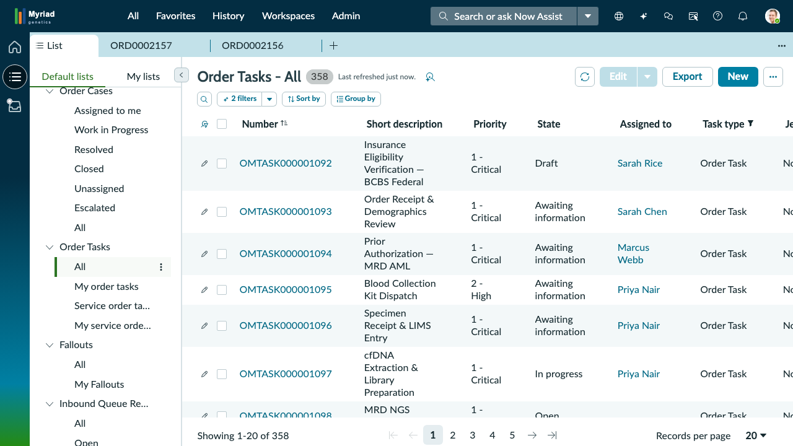
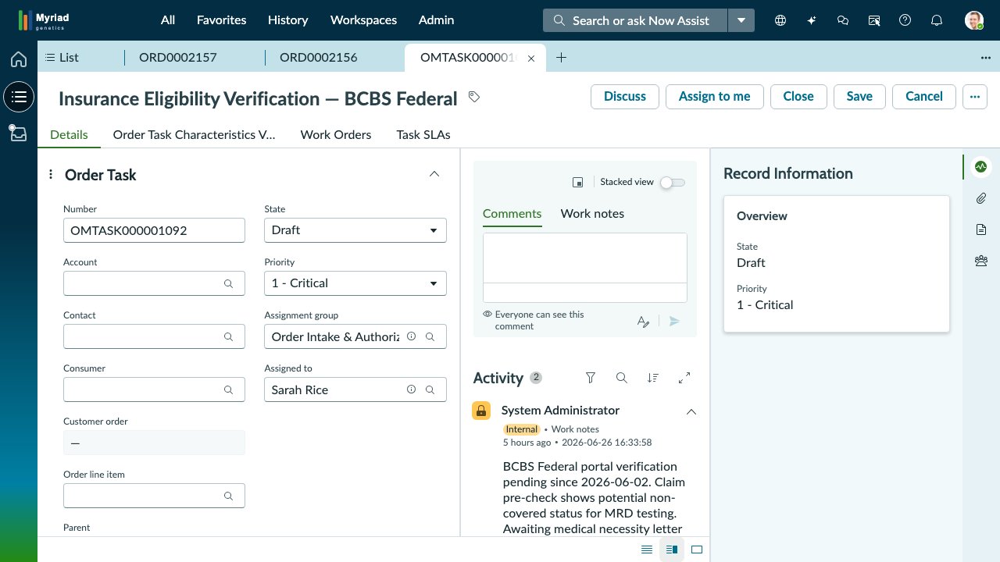

## Exercise 3: Order Intake & Task Resolution

**Persona:** Sarah Rice — Order Intake Specialist
**Duration:** ~15 minutes
**Objective:** Impersonate Sarah Rice, navigate to the Order Tasks list, locate a critical insurance verification task, open the record, review its form fields and activity stream, and explore the task tabs.

---

**The Scene:** It's the start of Sarah Rice's shift. Before anything else, she triages her task queue — scanning for the highest-priority items that need immediate attention. Today, one task rises to the top: **OMTASK000001092 — Insurance Eligibility Verification — BCBS Federal**. This task is Priority 1-Critical and is currently blocked: the referring physician hasn't yet sent the medical necessity letter that BCBS Federal requires before they'll confirm coverage for MRD (Minimal Residual Disease) testing. Sarah needs to open the task, review the latest updates, and understand exactly where things stand so she can follow up.

---

### Step 1: Impersonate Sarah Rice

Before you can see Sarah's task queue, you need to tell ServiceNow that you want to work as Sarah Rice. This is called **impersonating** a user.

1. Look at the **very top-right corner** of your ServiceNow screen. You will see a small **avatar icon** (it may look like a person's silhouette or your admin initials).
2. **Click** that avatar icon. A dropdown menu will appear.
3. In the dropdown, **click** the option labeled **Impersonate User** (or **Impersonate Another User**).
4. A search dialog will appear. In the search field, **type** `Sarah Rice`.
5. When her name appears in the results list below the search field, **click** on **Sarah Rice** to select her.
6. **Click** the **Impersonate User** button (or simply click her name if it immediately switches).

The page will briefly reload. You are now working as Sarah Rice — everything you see will reflect her role, her permissions, and her assignments.

> **Note:** Impersonation is a training/admin feature. In a real production environment, each user logs in with their own credentials and sees only their own workspace. No one needs to "impersonate" themselves.

---

### Step 2: Open the Configurable Workspace

You should now be inside the **ServiceNow Configurable Workspace** — the main interface Sarah uses every day. Take a moment to orient yourself:

Look at the **very top of the screen**, spanning the full width of the page. This is the **top navigation bar**. It contains tabs from left to right:

**All** | **Favorites** | **History** | **Workspaces** | **Admin**

> **Note:** Do not confuse this with the dark left sidebar (which has icons and module lists). The **All**, **Favorites**, **History**, **Workspaces**, and **Admin** tabs are in the **top navigation bar** — a separate horizontal strip at the very top of the page.

If you are not already in the workspace (for example, if you see the older "classic" ServiceNow interface with a white background and a banner across the top), do the following:

1. In the **top navigation bar**, **click** the tab labeled **Workspaces**.
2. From the list that appears, **click** on the workspace your lab uses (it may be labeled **CSM/FSM Configurable Workspace**, **OMS Workspace**, or similar — your instructor will confirm the exact name).

You should now see the workspace with its dark left sidebar and the top navigation bar above it.

> **Note:** The "workspace" is ServiceNow's modern, streamlined interface designed for daily task work. Think of it like the "home base" where all of Sarah's work happens — lists, records, and activity streams are all accessible from here without leaving this view.

---

### Step 3: Navigate to Order Tasks — All

Now you need to find the list of **all Order Tasks** — the master queue of work items across the OMS lab.

1. In the **dark left sidebar**, look for a section called **Default lists** (you may need to scroll down slightly in the sidebar to find it).
2. Under Default lists, you'll see a category called **Order Tasks**. **Click** on **Order Tasks** to expand it.
3. When it expands, you'll see a sub-option labeled **All**. **Click** on **All**.

The main area of your screen (the large panel to the right of the sidebar) will now display a **table** — a list of all Order Tasks in the system.

> **Note:** "All" means every Order Task regardless of status, priority, or who it's assigned to. In a real shift, Sarah might use filtered views, but for this exercise, we're starting with the full list so you can learn how the workspace displays data.

*You should see a view similar to this screenshot — a table of Order Tasks with hundreds of records.*

---

### Step 4: Understand the List Columns

Before searching for Sarah's task, take a moment to read the **column headers** across the top of the table. Each column tells you something different about every task:

| Column | What It Tells You |
|---|---|
| **Number** | The unique ID for the task (e.g., OMTASK000001092). Every task gets its own number — no two are alike. |
| **Short description** | A brief summary of what the task involves (e.g., "Insurance Eligibility Verification — BCBS Federal"). |
| **Priority** | How urgent the task is. **1-Critical** is the highest; it means this task demands immediate attention. |
| **State** | Where the task is in its lifecycle — Draft, Awaiting information, In progress, etc. |
| **Assigned to** | The person responsible for working this task right now. |
| **Task type** | The category of work (e.g., verification, accessioning, lab prep). |
| **Jeopardy** | A flag indicating whether the task is at risk of missing its SLA (Service Level Agreement) deadline. |

> **Note:** You can think of this list like a shared spreadsheet that the entire OMS team can see. Each row is one task; each column is one piece of information about that task.

---

### Step 5: Locate OMTASK000001092

The list contains **358 tasks** — far too many to scan manually. You need to find Sarah's specific task. Here's how:

1. Look at the **very first column header** in the table — it says **Number**.
2. **Click directly on the column header text** that says **Number**. A small **search/filter field** will appear just below the header (it looks like a narrow text box embedded in the column).
   - *If clicking the header sorts the column instead of showing a search box, look for a small **funnel icon** (🔍) next to the column name and click that instead.*
3. In that search field, **type**: `OMTASK000001092`
4. **Press the Enter key** on your keyboard.

The list will filter down. You should now see **one row**:

| Number | Short description | Priority | State | Assigned to |
|---|---|---|---|---|
| OMTASK000001092 | Insurance Eligibility Verification — BCBS Federal | 1-Critical | Draft | Sarah Rice |

> **Note:** Filtering by the Number column is the fastest way to find a specific task when you already know its ID. You could also filter by "Assigned to" to see all of Sarah's tasks — but for now, we're targeting one specific record.

---

### Step 6: Open the Task Record

Now that you can see OMTASK000001092 in the filtered list, you need to **open** it to see its full details.

1. In the filtered list, find the row for **OMTASK000001092**.
2. **Click** on the **blue, underlined text** that reads `OMTASK000001092` in the Number column. (It's a hyperlink — just like clicking a link on a webpage.)

The screen will change to a **split-pane view** — the task record's detail view:

- **Left pane:** The **form** — a structured set of fields containing all the task's data (Number, State, Priority, Account, Assignment group, Assigned to, and more).
- **Right pane:** The **Activity stream** — a chronological feed of comments, work notes, and updates related to this task. You'll also see tabs for **Comments** and **Work Notes** above the stream.

*Your screen should look similar to this screenshot — the form on the left, the activity feed on the right.*

> **Note:** The split-pane layout is one of the most important views in the workspace. You'll spend a large portion of every shift in this view — reading task details on the left while reviewing the conversation history on the right.

---

### Step 7: Review the Form Fields (Left Pane)

Look at the **left pane** of the split view. This is the **task form** — it contains structured data about OMTASK000001092. Locate and read each of the following fields:

| Field | Value You Should See | What It Means |
|---|---|---|
| **Number** | OMTASK000001092 | The unique task identifier. |
| **State** | Draft | This task has been created but not yet moved into active work. Sarah will update this once she begins working it. |
| **Priority** | 1-Critical | Highest urgency. This insurance verification is blocking downstream lab work. |
| **Account** | *(The patient's insurance account or ordering facility — read whatever value is displayed.)* | Identifies which account or organization this task relates to. |
| **Assignment group** | *(Read the value displayed.)* | The team responsible for this category of work. |
| **Assigned to** | Sarah Rice | Sarah owns this task — it's in her personal queue. |
| **Customer order** | *(Read the value displayed.)* | Links this task back to the original customer/patient order. |
| **Order line item** | *(Read the value displayed.)* | The specific test or service within the order that this task supports. |
| **Parent** | *(Read the value displayed, if any.)* | If this task is a subtask of a larger task, the parent task is shown here. |

> **Note:** You don't need to memorize every field right now. The key takeaway is that the form gives you the **structured "who, what, and where"** of the task — who it's assigned to, what state it's in, and where it fits within the larger order.

---

### Step 8: Read the Activity Stream (Right Pane)

Now shift your attention to the **right pane**. This is the **Activity Stream** — a chronological record of everything that has happened on this task. Think of it like a chat thread, with the most recent entry at the top.

1. Scroll through the Activity Stream. You may see entries such as:
   - **Work notes** (often displayed in a distinct color — orange or similar) — internal-only messages from team members that are not visible to the patient or physician
   - **Comments** — notes that may be shared more broadly
   - **Field changes** — automated log entries showing when a field value was updated (e.g., "Priority changed to 1-Critical")

2. Look for any entry that references **BCBS Federal** or **medical necessity letter**. If a note exists, read it carefully to understand the current status of the follow-up. If no notes appear, that itself tells you something — no one has documented this task's status yet.

> **Note:** The Activity Stream is the single source of truth for *what has happened* on this record. Sarah always reads it before taking any action — she does not want to duplicate a step someone else already took.

---

### Step 9: Update the Task State

Sarah has confirmed the task is still blocked, but she is now actively working it. She needs to update the **State** field from **Draft** to **In Progress** so her team knows this task is live.

1. In the **left pane** (the task form), locate the **State** field. It currently shows **Draft**.
2. **Click** on the **State** field. A dropdown list of state options will appear.
3. Select **In Progress** from the dropdown.
4. Look at the **top of the record** for a **Save** or **Update** button.
5. **Click** **Save** (or **Update**) to commit the change.

The form will refresh. The **State** field should now show **In Progress**.

> **Note:** State changes are tracked automatically in the Activity Stream — once you save, you will see a new entry appear at the top of the stream confirming the state change. This is how teams maintain an audit trail without any manual logging.

---

### Step 10: Add a Work Note

Sarah wants to document that she is actively following up today. She will add an internal **Work Note** — a note that only Myriad's operations team can see.

1. In the **right pane** (Activity Stream area), look for a text input area or a button labeled **Work notes** or **Add work note**. Click it to expand the input field.
2. Type the following note into the field, or write something equivalent in your own words:

   > *Following up with referring physician's office re: BCBS Federal medical necessity letter for MRD testing on ORD0002156. Status: awaiting callback from Dr. Chen's office. Will update once letter is received or after close of business.*

3. Before posting, confirm you are adding a **Work note** and not a **Comment** — most interfaces show a radio button or tab toggle between the two. Work notes stay internal; comments may be shared.
4. **Click** **Submit** (or **Post** or **Add**) to save the note.

The Activity Stream will refresh and your work note will appear at the top, timestamped to right now.

> **Note:** This note protects Sarah and her colleagues. If someone else picks up this task tomorrow, they immediately see it is being worked — no duplication, no wasted follow-up calls.

---

### Step 11: End Impersonation

You have completed Sarah Rice's scenario.

1. Click the **avatar/name** in the **top-right corner** of the screen (it should still show **Sarah Rice**).
2. In the dropdown menu, click **End Impersonation** (or **Stop Impersonating**).
3. The page will reload and your admin account name will return to the top-right corner.

---

### Checkpoint ✓

You have completed Exercise 3. Before moving on, confirm you can answer these questions:

- **What table did you navigate to find OMTASK000001092?** *(Order Tasks — All)*
- **What was the initial State of the task?** *(Draft)*
- **What State did you change it to?** *(In Progress)*
- **Where in the screen layout is the Activity Stream located?** *(Right pane)*
- **Why are Work Notes different from Comments?** *(Work notes are internal-only — not visible to patients or external parties)*

---

> **Bridge to Exercise 4 →** Sarah is following up on a blocked task. Meanwhile, a separate issue has escalated — a patient portal failure is preventing a physician from accessing test results. That's a **support case**, not a task. Meet **Julie Castillo**, the person who handles exactly this kind of post-order problem.