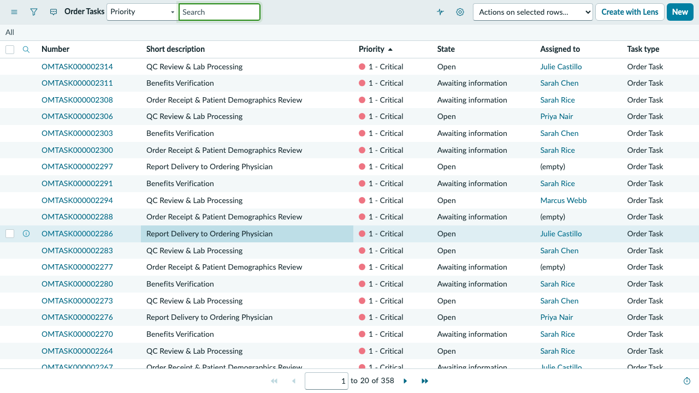
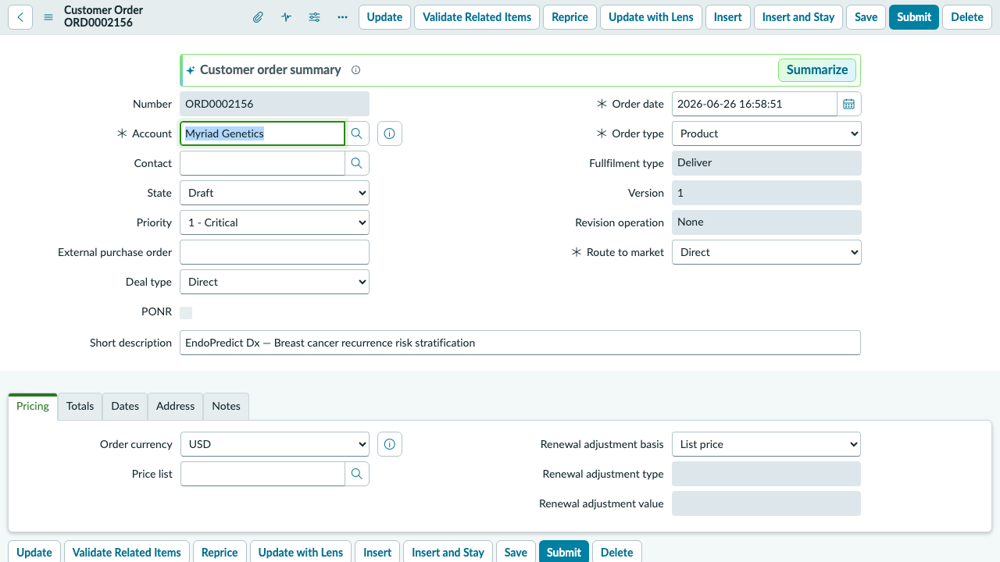
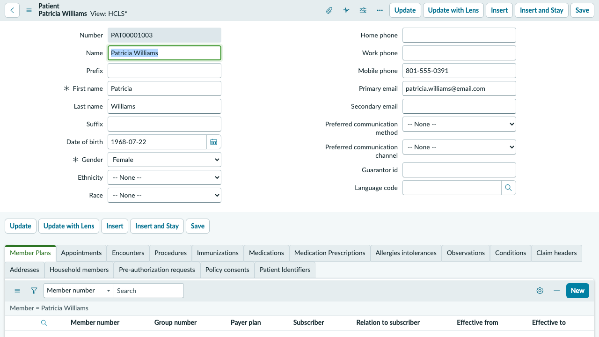

## Exercise 3: Order Intake & Task Resolution

**Persona: Sarah Rice — Order Intake Specialist**
**Duration: ~15 minutes**

> **Objective:** Work Sarah Rice's task queue. You will navigate the Order Tasks list, identify the most urgent exceptions on Patricia Williams' stalled EndoPredict order (ORD0002156), and understand how intake specialists move orders through the verification and processing pipeline.

---

### Scene

Sarah Rice starts each shift by triaging her task queue — sorted by age, priority, and order status. ORD0002156 (Patricia Williams, EndoPredict Dx) has been sitting at **New** status for 40 days with six unresolved task exceptions. It's Sarah's most urgent order today. The patient's oncologist — Dr. Sarah Mitchell — has called twice asking for a status update.

---

### Step 1 — Impersonate Sarah Rice

1. Select your **user avatar** → **Impersonate another user**.
2. Type `sarah.rice` → select **Sarah Rice** → **Impersonate user**.

---

### Step 2 — Navigate to Order Tasks

1. In the filter navigator, type `Order Tasks` (or navigate via **Order Management > Order Tasks**).
2. The Order Tasks list opens — filtered to tasks assigned to Sarah Rice's group or directly to her.

---

### Step 3 — Identify the Highest Priority Task

1. Sort the list by **Priority** (ascending) then by **Opened** (oldest first).
2. Locate **OMTASK000001397** — *Awaiting Information* — assigned to Sarah Rice.
   - **Order:** ORD0002156 (Patricia Williams — EndoPredict Dx)
   - **Age:** 12 days in current status
   - **Priority:** 1 — Critical
3. Select **OMTASK000001397** to open it.

> **Why is this critical?** EndoPredict Dx is a prognostic test for breast cancer recurrence risk. Patricia's treatment plan decision — whether she needs chemotherapy — cannot be finalized until the result is available. Every day of delay affects patient care.

---

### Step 4 — Review the Task and Its Context

On the task record, examine:

| Field | Value |
|-------|-------|
| **Short Description** | Insurance eligibility verification — AET-516-PTW |
| **State** | Awaiting Information |
| **Order** | ORD0002156 |
| **Patient** | Patricia Williams |
| **Insurance Member ID** | AET-516-PTW (Aetna Select Network, HMO) |
| **Assigned to** | Sarah Rice |
| **Opened** | 12 days ago |

1. Scroll to the **Activity** section — review any prior notes on this task.
2. Note that this task is blocked on Aetna prior authorization — the HMO plan requires pre-approval for CPT 81521 (EndoPredict).

---

### Step 5 — Navigate to ORD0002156 (Patricia Williams' Order)

1. On the task, select the **Order** field link — **ORD0002156**.
2. The full order record opens. Review the header fields:

| Field | Value |
|-------|-------|
| **Status** | New |
| **Patient** | Patricia Williams |
| **Test** | EndoPredict Dx |
| **Collection Method** | Tissue Biopsy (FFPE Tumor Block) |
| **ICD-10** | C50.911 — Malignant neoplasm of unspecified site of right female breast |
| **Facility** | Huntsman Cancer Institute |
| **Needs Attention** | Yes |

---

### Step 6 — Review All Open Tasks on ORD0002156

1. Scroll to the **Order Tasks** related list on ORD0002156.
2. You will see 23 tasks in total. Identify the open/attention-flagged tasks:

| Task | Description | State | Age |
|------|-------------|-------|-----|
| OMTASK000001397 | Insurance eligibility verification | Awaiting Information | 12 days |
| Additional tasks | Sample logistics, consent verification, physician signature | Various open states | — |

3. Select a few additional tasks to understand the scope of exceptions on this order.

> **The pattern:** ORD0002156 has accumulated exceptions across multiple task categories — eligibility, consent, sample, and signature. This is the signature presentation of an order that arrived with incomplete paperwork (tissue biopsy orders require more documentation than blood draws).

---

### Step 7 — View Patricia Williams' Patient 360

1. On ORD0002156, select the **Patient** field link — **Patricia Williams**.
2. On her Patient 360 record, review:
   - **Active Conditions:** Malignant neoplasm of breast (C50.911), Estrogen receptor positive status (Z17.0)
   - **Member Plan:** Aetna Select Network — HMO (AET-516-PTW)
   - **Allergies:** Sulfa drugs — rash (mild)
   - **Appointments:** Initial consult May 15, 2026 (fulfilled) — EndoPredict ordering discussed

3. Navigate back to ORD0002156 using the breadcrumb.

---

### Step 8 — Review the CSM Cases Linked to ORD0002156

1. Scroll down on ORD0002156 to find the **Cases** related list (or navigate via **Order Management > Cases**).
2. You will see 6 CSM cases linked to this order:

| Case | Issue |
|------|-------|
| CS0001022 | Patient consent not documented |
| CS0001023 | Insurance denial — appeal pending |
| CS0001024 | Sample rejected — re-collection needed |
| CS0001025 | Physician signature expired |
| CS0001026 | Courier pickup missed |
| CS0001027 | Benefits verification discrepancy |

> **Observation:** These cases are handled by Julie Castillo's Order Support team — not Sarah Rice. The intake specialist resolves task-level exceptions; the support team manages external communications and escalations. You'll work those cases in Exercise 4.

---

### Step 9 — End Impersonation

1. Select your **user avatar** → **End impersonation**.

---

### ✅ Exercise 3 Checkpoint

From Sarah Rice's task queue you observed:

- **Order Tasks** are the operational engine of the intake workflow — each exception type (eligibility, consent, sample, signature) maps to a specific task category.
- ORD0002156 has **23 tasks and 6 open CSM cases** — an unusually high exception count that signals a complex, documentation-heavy biopsy order.
- The **Patient 360** record surfaces insurance, conditions, and appointments in context — Sarah doesn't need to leave the order workspace to understand the patient's clinical situation.

**What happens next:** The six CSM cases on ORD0002156 are in Julie Castillo's queue. Exercise 4 moves to the Customer Service workspace where provider inquiries, insurance appeals, and sample logistics are managed.

---
