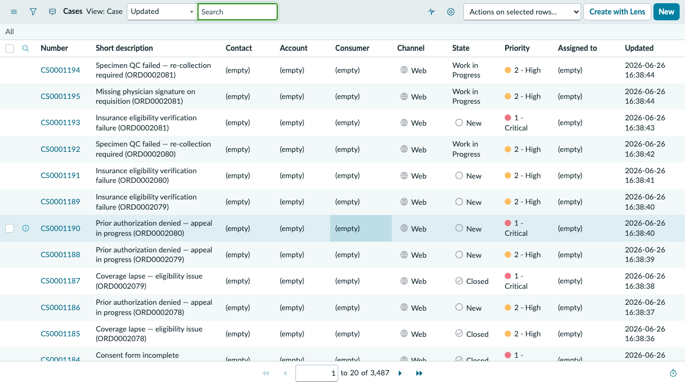
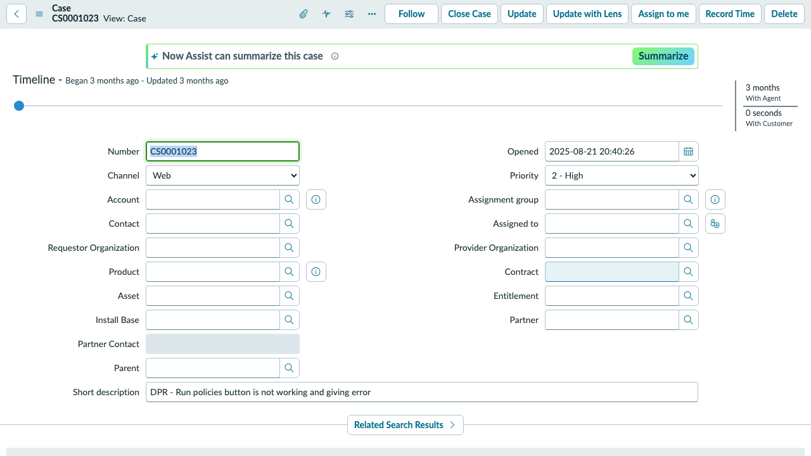
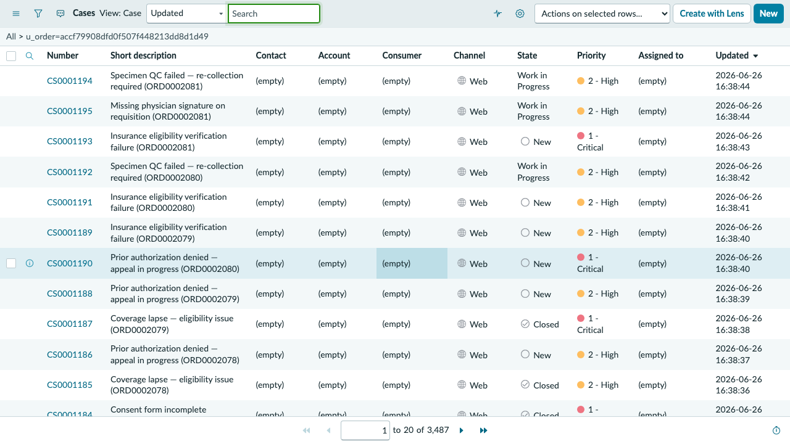

## Exercise 4: Order Support Services

**Persona: Julie Castillo — Order Support Services**
**Duration: ~15 minutes**

> **Objective:** Work Julie Castillo's case queue in the Customer Service workspace. You will open the six exception cases on ORD0002156 (Patricia Williams), understand what each case represents operationally, and see how external communications — provider calls, insurance appeals, sample re-collection — are managed alongside the core order workflow.

---

### Scene

Julie Castillo handles everything that goes wrong after an order is placed — and on ORD0002156, a lot has gone wrong. Aetna denied coverage, the tissue sample was rejected (incorrect fixation time), the physician's signature expired before the order was submitted, and the courier missed the initial pickup window. Each exception is its own escalation track. Julie's job is to keep all six moving in parallel while keeping Dr. Mitchell and the Huntsman team informed.

---

### Step 1 — Impersonate Julie Castillo

1. Select your **user avatar** → **Impersonate another user**.
2. Type `julie` → select **Julie Castillo** → **Impersonate user**.

---

### Step 2 — Navigate to Customer Service Cases

1. In the filter navigator, type `Cases` or navigate to **Customer Service > Cases**.
2. The Cases list opens — showing cases assigned to Julie's group.

---

### Step 3 — Filter Cases to ORD0002156

1. In the Cases list, search or filter for **Order = ORD0002156** (or search for patient name **Patricia Williams**).
2. You should see all six cases:

| Case | Short Description | Priority |
|------|------------------|----------|
| CS0001022 | Patient consent not documented | High |
| CS0001023 | Insurance denial — appeal pending | Critical |
| CS0001024 | Sample rejected — re-collection needed | Critical |
| CS0001025 | Physician signature expired | High |
| CS0001026 | Courier pickup missed | Medium |
| CS0001027 | Benefits verification discrepancy | High |

---

### Step 4 — Open CS0001023 (Insurance Denial — Appeal)

1. Select **CS0001023** to open the case.
2. Review the case details:

| Field | Value |
|-------|-------|
| **Short Description** | Insurance denial — EndoPredict Dx CPT 81521 — appeal pending |
| **Account** | Myriad Genetics |
| **Patient** | Patricia Williams |
| **Insurance** | Aetna Select Network (HMO) |
| **Priority** | Critical |
| **State** | Open |

3. Read through the **Activity** feed — this is where the appeal correspondence, authorization codes, and call log notes would be recorded during a live case.

> **Context:** Aetna HMO plans typically require step therapy and prior authorization for molecular diagnostic tests. CPT 81521 (EndoPredict) has an authorization requirement under most Aetna HMO commercial plans. The appeal team needs the treating physician's clinical notes and the NCCN guideline reference supporting medical necessity.

---

### Step 5 — Open CS0001024 (Sample Rejected)

1. Navigate back → select **CS0001024**.
2. Review the case:

| Field | Value |
|-------|-------|
| **Short Description** | Sample rejected — FFPE block fixation time out of spec |
| **Priority** | Critical |
| **State** | Open |

3. Read the case description:
   - The FFPE tumor block from Patricia's April 5 biopsy was rejected by the lab — fixation time was recorded as 5 hours, below the 6–72 hour minimum required for accurate RNA extraction.
   - Re-collection requires a new biopsy. Dr. Mitchell has been notified. The Huntsman pathology team is reviewing archived tissue blocks for an eligible specimen.

> **Why this matters:** Sample rejection is one of the top three reasons genomic orders fail to result. Re-collection delays can add 3–6 weeks to the order timeline — in Patricia's case, that delay directly affects her treatment planning window.

---

### Step 6 — Open CS0001025 (Physician Signature Expired)

1. Navigate back → select **CS0001025**.
2. Review:
   - The original order was submitted on May 15 but Dr. Mitchell's wet signature on the paper TRF expired after 30 days (June 15).
   - Re-signature is required. The TRF has been re-sent to Huntsman via fax.

---

### Step 7 — Review the Remaining Cases

1. Briefly open **CS0001022** (consent), **CS0001026** (courier), and **CS0001027** (benefits) to complete the picture.
2. For each, note the state and most recent activity entry.

> **The pattern:** Every case on ORD0002156 is a real-world operational failure mode in genomic diagnostics — insurance, sample quality, documentation, logistics, and benefits. On average, complex biopsy orders generate 2–4 exception cases. Six cases on a single order is a clear signal that this order's intake process broke down at multiple handoff points.

---

### Step 8 — End Impersonation

1. Select your **user avatar** → **End impersonation**.

---

### ✅ Exercise 4 Checkpoint

From Julie Castillo's case queue you observed:

- CSM cases are the **external-facing exception layer** — they capture the back-and-forth with providers, insurers, and couriers that the internal task queue doesn't surface.
- ORD0002156 has **six concurrent exception types** — insurance denial, sample rejection, expired signature, missing consent, missed courier, and benefits discrepancy — all requiring parallel resolution.
- The **Activity feed** on each case is the audit trail: every call, note, authorization code, and status update is captured in sequence.

**What happens next:** John Kim's analytics view in Exercise 5 will show what this exception pattern looks like at scale — across 40+ orders and 6+ months of order history.

---
