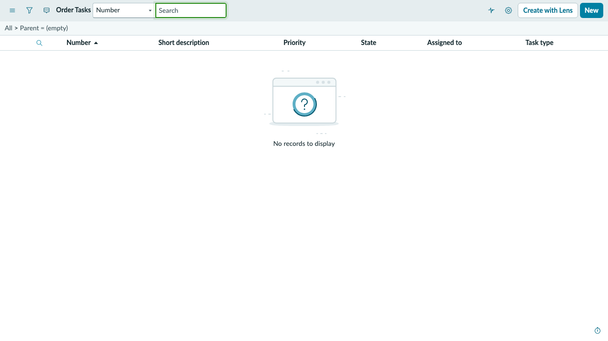
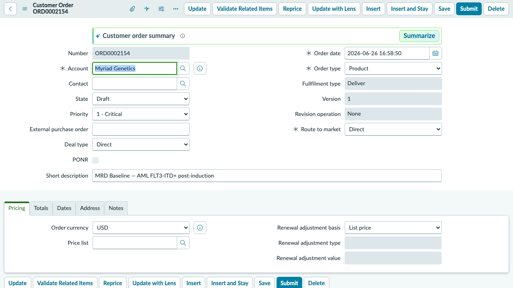

## Exercise 5: Analytics & AI Insights

**Persona: John Kim — Supervisor / Analytics Lead**
**Duration: ~15 minutes**

> **Objective:** Step into John Kim's supervisory view. You will explore the Order Management analytics — order volume by status, turnaround time trends, team task performance, and exception rates by order type. These are the metrics that drive weekly operational reviews at Myriad.

---

### Scene

John Kim runs the weekly operations review for the Order Management team. Every Monday morning he pulls four numbers: orders-in vs. orders-resulted (the throughput ratio), average age of the Awaiting Information bucket (the stall indicator), exception case rate by test type (the quality signal), and task completion rate by team member (the capacity view). ServiceNow surfaces all four in a single workspace — no spreadsheet pulls, no cross-system queries.

---

### Step 1 — Impersonate John Kim

1. Select your **user avatar** → **Impersonate another user**.
2. Type `john.kim` → select **John Kim** → **Impersonate user**.

---

### Step 2 — Navigate to Order Management Reports

1. In the filter navigator, type `Reports` or navigate to **Now Intelligence > Reports**.
2. Look for any pre-built reports under the **Order Management** category, or navigate directly to the Orders list for analytics.

---

### Step 3 — Order Volume by Status

1. Navigate to **Order Management > Orders**.
2. Use the list to group or filter by **Order Status** to understand the current distribution.
3. Count orders in each status bucket:

| Status | Expected Count | Operational Meaning |
|--------|---------------|---------------------|
| New | ~3 | Just submitted, not yet triaged |
| Awaiting Information | ~4 | Stalled — missing data, pending auth |
| Sample Received | ~3 | Specimen in hand, processing queued |
| Lab Processing | ~5 | Active sequencing / analysis |
| Clinical Review | ~2 | Results ready, awaiting sign-off |
| Results Available | ~3 | Ready for delivery to provider |
| Report Delivered | ~8 | Closed — result sent to ordering physician |

> **The insight:** If Awaiting Information is growing week over week, that's a leading indicator of intake process breakdown — either eligibility delays, documentation gaps, or insurance issues are piling up.

---

### Step 4 — Filter Orders by Test Type (Product)

1. In the Orders list, apply a filter for each major product type and count:

| Test | Orders | % of Total |
|------|--------|-----------|
| MyRisk 25-Gene Hereditary Panel | ~10 | Highest volume — hereditary cancer risk |
| MRD Baseline (AML + NHL) | ~8 | High-value oncology monitoring |
| EndoPredict Dx | ~5 | Biopsy-based — highest exception rate |
| Precise Tumor 500 | ~4 | Complex CGP — long turnaround |
| MRD Monitoring T1/T2 | ~6 | Repeat test for existing series patients |

> **The insight:** Biopsy-based tests (EndoPredict, Precise Tumor 500) have significantly higher exception rates than blood-draw tests (MyRisk, MRD). This drives the CSM case volume Julie Castillo manages — an insight that argues for a pre-submission checklist for tissue orders.

---

### Step 5 — Order Task Performance

1. Navigate to **Order Management > Order Tasks** (or **All > Order Tasks**).
2. Review tasks across the full queue:
   - Sort by **Assigned To** to see workload distribution across Sarah Rice, Sarah Chen, Marcus Webb, and Priya Nair.
   - Sort by **State** to see how many tasks are open vs. resolved.
   - Sort by **Opened** (oldest first) to identify the most aged tasks.

3. Note the concentration of tasks on ORD0002156 (Patricia Williams):
   - 23 tasks on a single order is an outlier — a signal for the supervisor to initiate an order review.

---

### Step 6 — Review CSM Case Volume

1. Navigate to **Customer Service > Cases** (or **All > Cases**).
2. Group by **State** to see open vs. resolved:

| State | Count |
|-------|-------|
| Open | ~6 |
| In Progress | ~variable |
| Resolved | ~variable |

3. Filter for **High** and **Critical** priority cases — these are Julie's active escalations.

---

### Step 7 — MRD Series Overview (Dorothy Martinez)

1. If the custom schema has been loaded, navigate to **Order Management > MRD Series** (or `sn_ind_tmt_orm` → MRD Series module).
2. Locate **MRD-SERIES-DMZ-AML-2024** — Dorothy Martinez's AML monitoring series.
3. Review the series record:

| Field | Value |
|-------|-------|
| **Series ID** | MRD-AML-DMZ-2024-001 |
| **Patient** | Dorothy Martinez |
| **Baseline Order** | ORD0002154 |
| **Series Status** | Active |
| **Cadence** | Every 3 months |
| **T0 Report Date** | July 1, 2026 |
| **T1 Due Date** | October 1, 2026 |
| **T2 Due Date** | January 1, 2027 |

> **The strategic value:** MRD series represent Myriad's highest-value, longest-duration customer relationships. A single AML patient on a 12-month monitoring series generates 4 orders — each requiring the same intake, verification, and logistics workflow. ServiceNow's ability to track the series-level relationship (baseline → T1 → T2 → T3) is what transforms a transaction system into a longitudinal patient management platform.

---

### Step 8 — End Impersonation

1. Select your **user avatar** → **End impersonation**.

---

### ✅ Exercise 5 Checkpoint

From John Kim's analytics seat you observed:

- **Order volume by status** reveals where the pipeline is healthy and where it's backing up.
- **Test type distribution** shows that biopsy orders generate disproportionate exception volume — a product-specific quality signal.
- **Task performance by assignee** surfaces capacity and workload distribution — a tool for staffing decisions.
- **MRD series tracking** elevates ServiceNow from a transactional order system to a longitudinal patient management platform.

**What happens next:** The Challenge round ties all five exercises together — you will trace a complete order from submission through results in a single end-to-end scenario.

---
